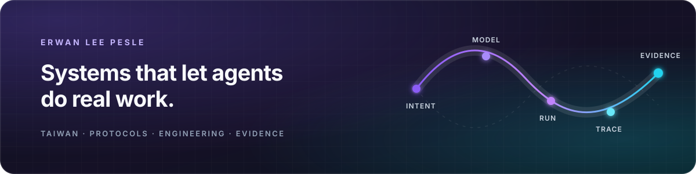

  <picture>
    <source media="(max-width: 600px)" srcset="assets/system-trace-mobile.svg" />
    
  </picture>

# Hi, I'm Erwan.

**I think in systems, build in code, and teach from the work.**

I'm the founder and software architect behind [Casys](https://casys.ai), based
in Taiwan. I work where agent protocols, engineering models, business systems,
data, and decision-making meet.

I like turning complicated real-world work into software that is executable,
inspectable, and useful to the people who own it.

[Casys](https://casys.ai) · [Open source](https://github.com/Casys-AI) ·
[Field notes](https://casys.ai/blog) · [Teaching](https://casys.ai/teaching) ·
[LinkedIn](https://www.linkedin.com/in/erwan-lee-pesle-32085463)

## What I build

- **Agent infrastructure** — MCP systems and operator surfaces that connect
  agents to the tools, permissions, knowledge, and traces behind real workflows.
- **Engineering software** — from system architecture to CAD and simulation,
  with evidence that carries into the wider workflow.
- **Data, graphs, and optimisation** — knowledge structures, exact models,
  heuristics, and interfaces that make difficult decisions legible.

## My favourite loop

`understand → model → build → run → document → teach`

I publish field notes, diagrams, and working examples alongside the code.
Documentation is part of the product, and teaching is how I test whether the
ideas remain useful outside the repository where they started.

## Selected work

Most of my open work lives at **[Casys-AI](https://github.com/Casys-AI)**. These
projects capture the range:

- **[casys-digital-thread](https://github.com/Casys-AI/casys-digital-thread)** —
  one engineering project from brief to proof, with the evidence behind each
  answer.
- **[mcp-platform](https://github.com/Casys-AI/mcp-platform)** — the TypeScript
  foundation behind Casys MCP servers and apps.
- **[mcp-erpnext](https://github.com/Casys-AI/mcp-erpnext)** — agent-operated
  ERPNext workflows with interactive views.
- **[mcp-chrono](https://github.com/Casys-AI/mcp-chrono)** — prescribed
  rigid-body kinematics with Project Chrono.

## Side quest

**[NutrientCompare](https://nutrientcompare.com)** is a transparent supplement
comparison project built for Taiwan.

If you're building a system where an agent needs to do more than talk,
[say hello](mailto:hello@casys.ai).
