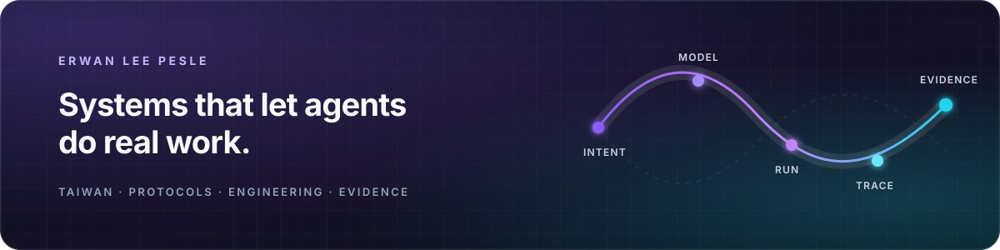

  <picture>
    <source media="(max-width: 600px)" srcset="assets/system-trace-mobile.svg" />
    
  </picture>

# Hi, I'm Erwan.

**I think in systems, build in code, and teach from the work.**

I'm a software architect and the founder of [Casys](https://casys.ai), based
in Taiwan. I work where agent protocols, engineering models, business systems,
data, and decision-making meet.

I like turning complicated real-world work into software that is executable,
inspectable, and useful to the people who own it.

I develop tools and software on my personal GitHub. Casys is dedicated to
**[Agentic Process Engineering](https://casys.ai/agentic-process-engineering/book)**.
I provide no-code training through **THE NO CODE GUY**, my legal company.

[Open source](https://github.com/superWorldSavior?tab=repositories) ·
[APE book](https://casys.ai/agentic-process-engineering/book) ·
[Field notes](https://casys.ai/blog) · [Teaching](https://casys.ai/teaching) ·
[LinkedIn](https://www.linkedin.com/in/erwan-pesle-32085463/)

## What I build

- **Agent infrastructure** — MCP systems and operator surfaces that connect
  agents to the tools, permissions, knowledge, and traces behind real workflows.
- **Engineering software** — from system architecture to CAD and simulation,
  with evidence that carries into the wider workflow.
- **Data, graphs, and optimisation** — knowledge structures, exact models,
  heuristics, and interfaces that make difficult decisions legible.

## My favourite loop

`understand → model → build → run → document → teach`

I publish field notes, diagrams, and working examples alongside the code.
Documentation is part of the product, and teaching is how I test whether the
ideas remain useful outside the repository where they started.

## Selected work

My open-source tools and software live on **[my personal GitHub](https://github.com/superWorldSavior?tab=repositories)**.
These projects capture the range:

- **[constraint-solver](https://github.com/superWorldSavior/constraint-solver)** —
  parametric constraints with units, for engineering models and verification.
- **[mcp-platform](https://github.com/superWorldSavior/mcp-platform)** — the
  TypeScript foundation for MCP servers and apps.
- **[mcp-erpnext](https://github.com/superWorldSavior/mcp-erpnext)** — agent-operated
  ERPNext workflows with interactive views.
- **[gsc-cli](https://github.com/superWorldSavior/gsc-cli)** — Google Search Console
  as a CLI and library, with structured output for agents.

## Side quest

**[NutrientCompare](https://nutrientcompare.com)** is a transparent supplement
comparison project built for Taiwan.

If you're building a system where an agent needs to do more than talk,
[say hello](mailto:hello@casys.ai).
